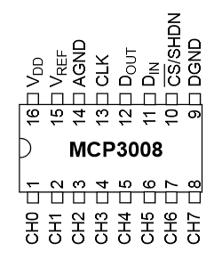

# RNBO-RPi-Pots
A short, simple tutorial for using Potentiometers with RNBO on the Raspberry Pi.

Unlike boards like the Arduino, the Raspberry Pi doesn't have an Analogue-to-Digital (ADC) converter to convert analogue signals to digital. In this article we'll learn how to use an ADC integrated circuit chip with the RPi to read in multiple Potentiometers at once and control a RNBO patcher.

> ⚙️ Before attempting this tutorial, make sure you're already familiar with the basics of exporting your RNBO patchers to the RPi and that your audio interface is working correctly with it.

## Things you'll need:

* 1 x MCP3008 IC
* 1+ x (breadboard friendly) Potentiometers[^1]
* Breadboard
* Hook up wires

[^1]: linear taper :B type potentiometers can be a little more versatile than audio taper (type A) , but we'll learn a trick in RNBO for how to adapt to either.

We'll start by exporting the following patcher to the Raspberry Pi target:


> Download [BasicGenerativePolyphony.maxpat](./BasicGenerativePolyphony.maxpat) 


To control the cutoff and resonance parameters of this patcher with our two potentiometers, we'll write a quick python script on the Raspberry Pi to use alongside the rnbo runner.

ssh in, or connect up a keyboard and monitor. We'll use a library that should already be on your RPi image called `gpiozero` and another for communicating with the runner via OSC. You can use any OSC library you like, this example will use `python-osc`.

Lets first create a working directory a python virtual environment by running these commands from your pi:

```bash
mkdir RNBO-Pots
cd RNBO-Pots
python -m venv .venv
```

Now we'll enter the python venv and install some python dependencies:
```bash
source .venv/bin/activate
pip install --upgrade pip gpiozero lgpio python-osc
```

Now `sudo poweroff` the RPi, and disconnect the power. Let's create our circuit:




1. `3.3v` (red) from the RPi connects to the `+V` bus rail
2. `GND` (black) from the RPi connects to the `ground` bus rail
3. `Vdd` (red) from the MCP3008 to the `+V` bus rail
4. `Vref` (red) from the MCP3008 to the `+V` bus rail
5. `AGND` (black) from the MCP3008 to the `ground` bus rail
6. `CLK` (purple) from the MCP3008 to RPi `SPI SCLK`
7. `Dout` (blue) from the MCP3008 to RPi `SPI MISO`
8. `Din` (yellow) from the MCP3008 RPi `SPI MOSI`
9. `CS/SHDN` (orange) from the MCP3008 to `RPi SPI CE0`
10. `DGND` (black) from the MCP3008 to `ground` bus rail
11. `CH6` (white) from MCP3008 to wiper (centre pin) potA
12. `CH7` (pink) from MCP3008 to wiper (centre pin) potB
13. `GND` (left pin) from PotA & PotB to `ground` bus rail
14. `+Vcc` (right pin) from PotA & PotB to `+V` bus rail

The readings from the MCP3008 channels are already normalized - so we can use these directly to control the each parameter via their `normalized` osc addresses. If you take a look in the patcher, you will see there is some logarithmic scaling of this via `@fromnormalized` which makes it feel more natural for the cutoff parameter. If you're using audio taper potentiometers (type A) then you should remove this scaling (the pot's taper is doing it for you).

Switch the Pi back on and at the terminal run the script:

```bash
cd RNBO-Pots
source .venv/bin/activate
python RNBO-RPi-2Pots.py
```

Now you should be able to wiggle some knobs and do some filter sweeps!


## Going further

As you can see, the MCP3008 has a total of eight channels you can use to read any analogue signal into the Raspberry Pi. You're not limited to only using Potentiometers here, there's a whole world of analogue signals you can mix and match. There's also plenty of other ADC chips you can explore with greater resolution and with greater or fewer channels.

Happy patching!
